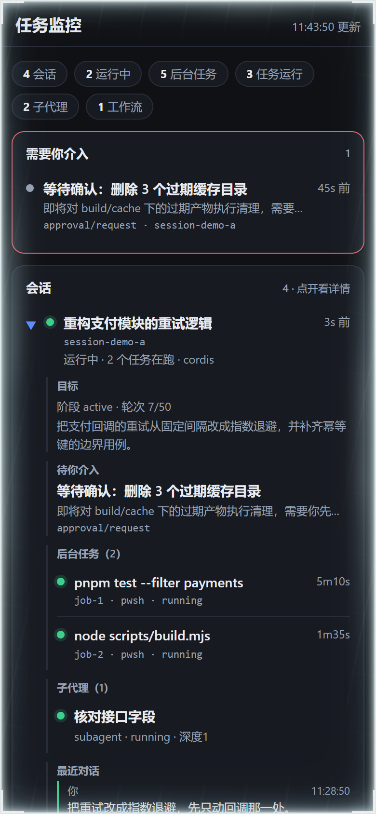
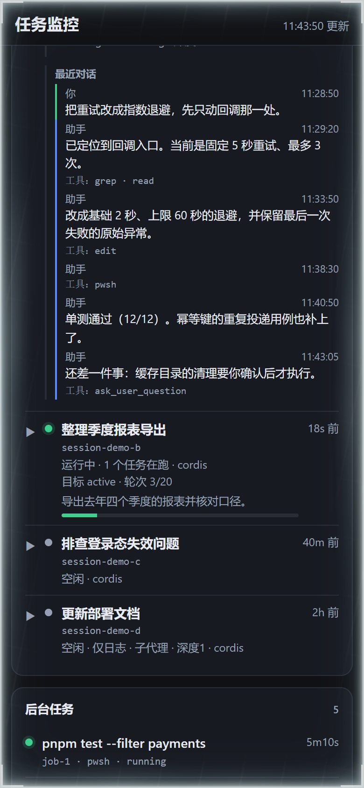

# dsh-taskwatch

Read-only task monitor for DeepSeek Harness. A phone-friendly status page plus a GUI
sidebar panel, covering sessions, background jobs, subagents, goal rounds, workflows
and pending approvals.

DeepSeek Harness 的只读任务监控：一个适配手机的只读状态页，加一个 GUI 侧边栏面板，
覆盖会话、后台任务、子代理、目标轮次、工作流与待审批事项。



展开一个会话后，它的目标、待介入事项、后台任务、子代理与最近对话都在原地：



> 两张图里的会话、任务、对话**全是演示用的假数据**，不是任何真实会话。它们由
> `docs/demo.html` 渲染——那个文件是 `scripts/make-demo.mjs` 从 `lib/page.html`
> 生成的，你可以直接用浏览器打开它，点着看，不需要装任何东西，也不会发出网络请求。

## 为什么需要它

DSH 的 Web GUI 没有内置鉴权，而默认 preset 往往是 `danger-full-access`。把整个 GUI
暴露到公网，等于把一台能执行任意命令的机器的入口挂出去。

但「看一眼任务跑到哪了」其实只需要**读**。所以这个插件把状态另外渲染成一份只读页面：
你可以在任何隧道或反向代理上**只放行这一条路径**，而不必把 GUI 本身暴露出去。

采集面完全通过 `ctx.get(...)` 软读取服务，任何一个服务不存在都只会让对应的那一块
留空，不会让插件挂载失败。

## 采集面

| 区块 | 内容 |
|---|---|
| 需要你介入 | 等待中的 `approval/request` 与 `user-questions/request` |
| 会话 | 运行/空闲、最后活动时间、该会话在跑的后台任务数、preset、cwd、是否仅日志 |
| 会话详情 | 点开后：目标、待介入事项、属于它的后台任务与子代理、最近对话 |
| 目标 | phase、轮次 `started/max`、activation、阻塞原因 |
| 后台任务 | id、label（多行命令已折成单行）、kind、status、生命周期时长、属主会话 |
| 子代理树 | 层级、深度、父会话、activity、mode |
| 工作流 | 当前 phase、日志条数、已运行时长 |
| 采集诊断 | 采集过程中单项失败的原因（不静默吞掉） |

## HTTP 路由

| 路径 | 类型 | 说明 |
|---|---|---|
| `/taskwatch` | HTML | 只读移动页，3 秒轮询；会话卡片可点开 |
| `/taskwatch/data` | JSON | 全部状态的快照 |
| `/taskwatch/session?id=&limit=` | JSON | 单个会话的最近对话（`limit` 上限 60，默认 20） |
| `/taskwatch/manifest.webmanifest` | JSON | PWA manifest |
| `/taskwatch/sw.js` | JS | service worker |
| `/taskwatch/icon-192.png` | PNG | 图标 |
| `/taskwatch/icon-512.png` | PNG | 图标（兼作 maskable） |

全部注册在 `ctx.webServer` 上，**没有**写操作、不接收请求体、不代理 DSH 自身的 `/api`。

### 页面为什么不做整页重建

页面每 3 秒轮询一次，但**数据没变就完全不碰 DOM**（比较序列化结果），只刷新右上角
时间戳。首版是 `root.innerHTML = h` 全量重建，结果是每 3 秒把页面拆一次：展开的东西
3 秒后被抹掉，滚动位置被打断，看起来像「不刷新」和「点不动」——那是同一个原因。

展开状态与对话缓存存在 JS 对象里，跨轮询保留；点击用事件委托挂在常驻容器上，
所以内层 DOM 重建也不会丢监听。对话按需懒加载，点开一次即缓存。

### `/taskwatch/session` 的两条限制

1. **只能读活着的会话。** `ctx.sessions` 是内存存储，`get(id)` 返回 `undefined` 时接口
   会**明确报错**「这个会话不在内存里（已落盘但未加载的会话读不到）」，而不是返回一个
   空的 `messages` —— 后者会让人误以为那个会话真的没说话。
2. **只读不写。** 没有发送消息、批准审批、打断运行的入口。要做到那些，必须把 DSH 的
   Web GUI 暴露出去，那是另一个量级的风险，本插件刻意不做。

消息只取叶子字段（role、text、工具名、时间），不把活的会话日志对象序列化出去。

## GUI 面板

`lib/client.js` 注册一个侧边栏面板（`sidebar.panellist`），数据取自同源的
`/taskwatch/data`，**不需要任何 host RPC**。样式全部挂在插件自己的 fiber 上，
卸载即还原。

## 安装

```sh
dsh plugin --profile web add dsh-taskwatch
```

装完需要**重启 `dsh web`**：插件行来自 profile 的 bundle 图，而 client 侧模块元数据
按 specifier 缓存且没有失效路径，所以增删插件一律要重启才生效。

本包**没有构建步骤**：`lib/` 是提交进仓库的、可直接运行的产物，客户端 bundle 就是
一个调用 `window.__ModuleLoader__.load({ id, factory })` 的普通脚本。从源码安装不需要
任何构建授权（`allowBuilds`）。

本地开发时也可以直接指向工作副本：

```sh
dsh plugin --profile web add <你的绝对路径>/dsh-taskwatch
```

补丁里引用插件有两种写法，注意区别：bundle 自带的 `cordis.patch.yml` 用**包名**
（由 profile 的 `node_modules` 解析），而 profile 自带补丁里若写路径，必须是绝对路径
（相对路径是相对该补丁文件解析的，跨盘会失败）。

## 在外网 / 手机上访问（需要你自己叠一层）

**本插件自己不做鉴权，只监听回环。** 它提供的是「可被安全转发的只读源」，转发这一层
由你自己的隧道或反向代理负责。一个已验证可用的组合是：

```
手机 / 外网
  └─ HTTPS  <你的域名>                反向代理：TLS 终止 + basic auth
       └─ 隧道回到本机                 ssh -R，或任何等价隧道
            └─ 本机只读中继             校验应用层共享令牌
                 ├─ /taskwatch、/taskwatch/data、/taskwatch/session → DSH 的回环端口
                 └─ manifest / sw.js / 图标                          → 中继本地文件
```

配套的只读中继是刻意做成**另一件事**的，不属于本插件：它是几十行的零依赖 Node 脚本，
把白名单里的固定路径转发到 DSH 的回环端口，其余一律 404。想自己写的话，要点就四条：

1. **白名单硬编码**，不要让上游路径可配置 —— 否则它就成了一个任意代理。
2. **只允许 GET/HEAD**，不接受请求体，不转发 `/api`。
3. **自带一层共享令牌**，定长比较（`timingSafeEqual`），并且不要把令牌转发给上游。
4. **转发时要带上查询串**。这一点踩过坑：漏掉它时 `/taskwatch/session` 会返回
   HTTP 200 但内容永远是「缺少 id 参数」——状态码看着完全正常，只是数据永远为空。

PWA 外壳由中继本地提供（而不是转发上游），这样它不随上游插件的版本变化而失效；
页面文件与插件共用同一份，避免两边漂移。

## 安全边界

- 插件的路由只在**回环**上监听，从不对外。
- 页面带 `X-Robots-Tag: noindex, nofollow`，响应带 `nosniff` 与 `no-store`。
- service worker 的作用域**限定为 `/taskwatch`**（注册时即指定，脚本也放在
  `/taskwatch/sw.js`），不允许它有机会拦截主 GUI 的请求。
- 状态数据**永不进缓存**：外壳可离线，但 `/taskwatch/data` 与 `/taskwatch/session`
  只走网络，断网时返回一份显式的 `offline: true` 空快照并在页面上明说 —— 对监控来说，
  看到过期状态比看到断连更危险。

## 已知限制

- 界面文案目前是**中文**，还没有做多语言。
- `/taskwatch/session` 只覆盖内存中的活跃会话（见上）。
- 服务没有鉴权，**不要**把它直接暴露到公网；请自行在前面加一层。
- 会话、任务、子代理各列表最多渲染 40 条，避免长会话把页面拖慢。
- 单条消息文本超过 4000 字符会被截断。

## 开发

```sh
node scripts/check-bundle.mjs   # 客户端 bundle 的契约测试（15 项）
node scripts/make-icons.mjs     # 重新生成图标（自实现 PNG 编码，零依赖）
node scripts/make-demo.mjs      # 生成 docs/demo.html（假数据，供截图与预览）
```

`scripts/make-icons.mjs` 是手写 PNG 编码（Node 内置 zlib + 自实现 CRC32），满幅不透明
方形，图形落在中心 80% 安全区内，因此同一个文件既能当普通图标也能当 maskable。

`scripts/make-demo.mjs` 从 `lib/page.html` **生成**演示页，只把取数逻辑换成一份固定
假数据。之所以是生成而不是手写：手写就意味着 CSS 与结构有两份副本，必然漂移，截图会
慢慢变成一张不像当前 UI 的图。README 里那两张图就是从生成物截的，所以只要 `page.html`
变了，重跑脚本再截一次就与实现一致。

## 许可证

Apache-2.0，见 [LICENSE](LICENSE)。
